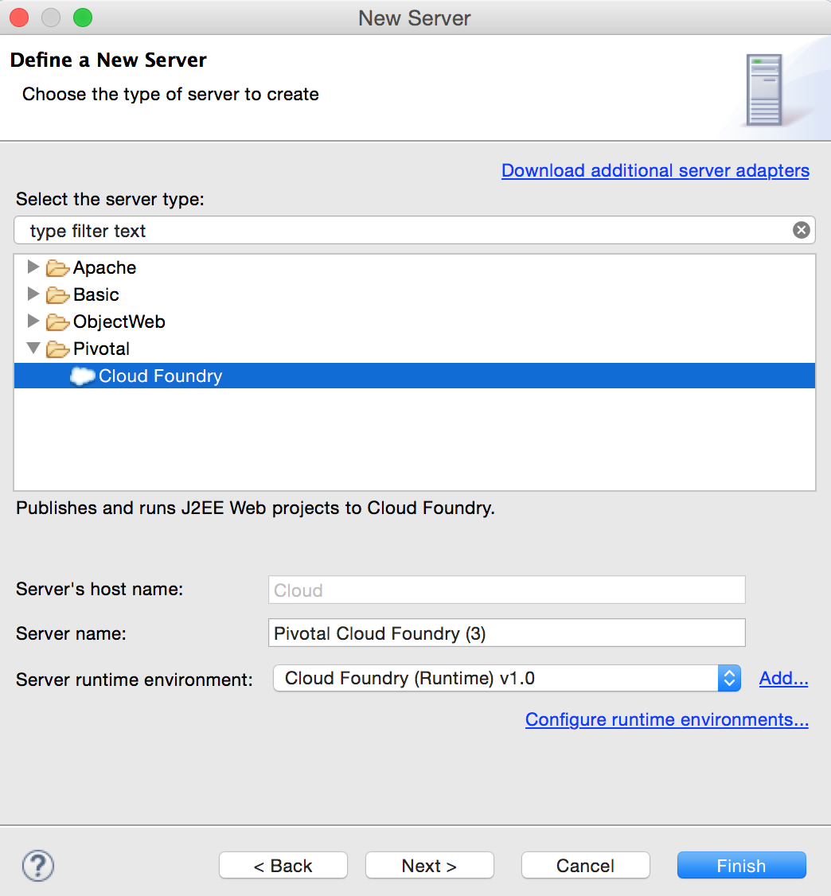
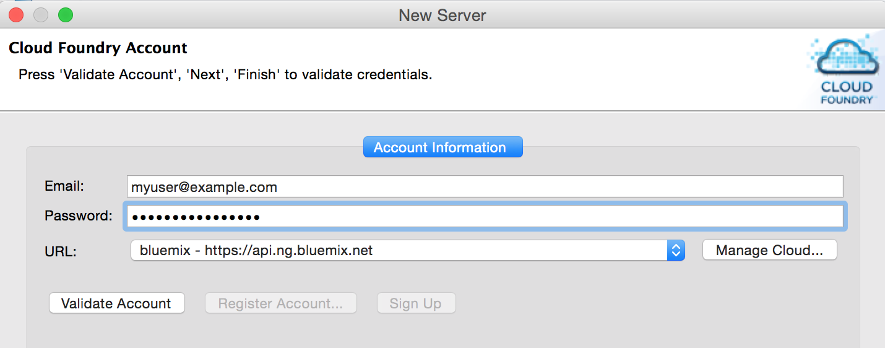
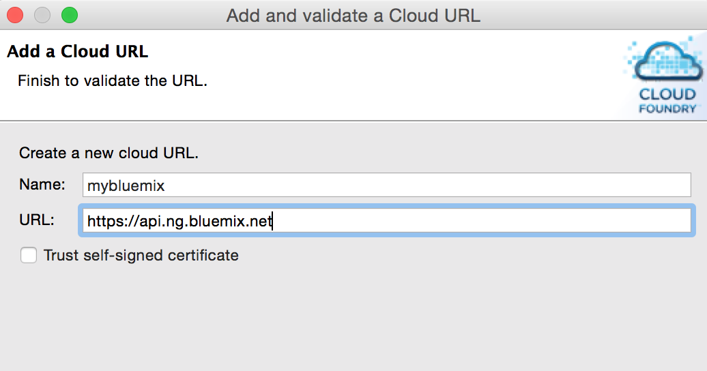
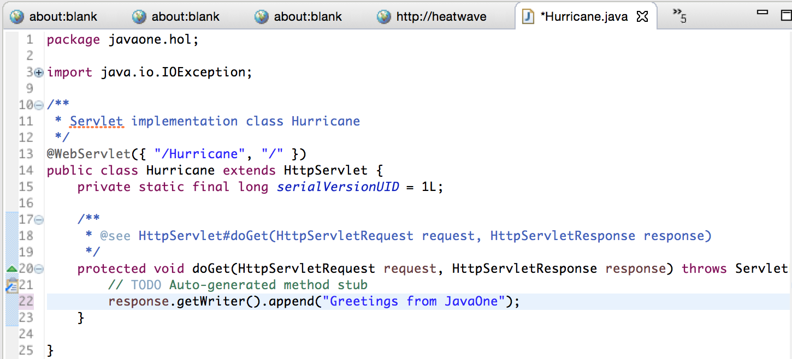
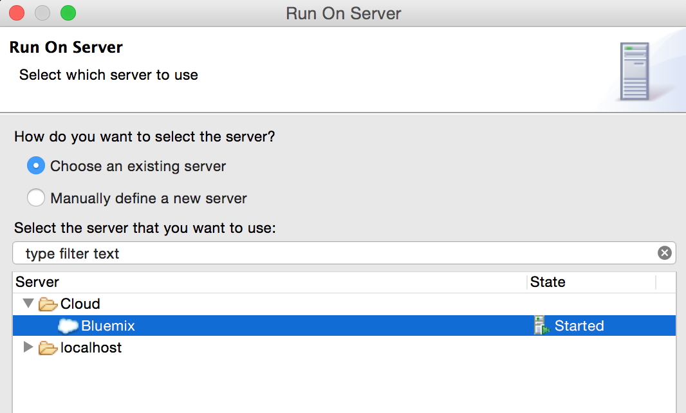
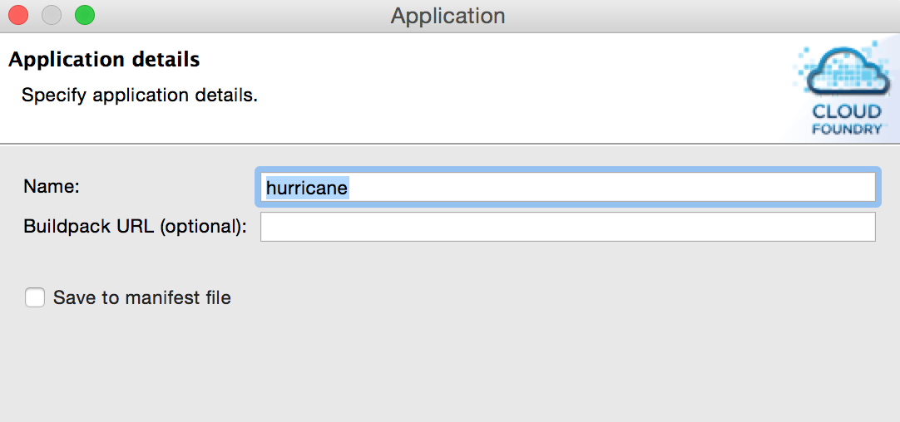
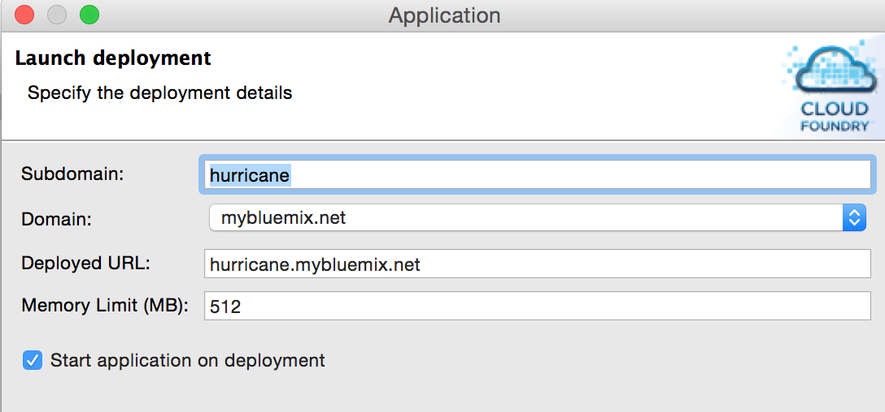
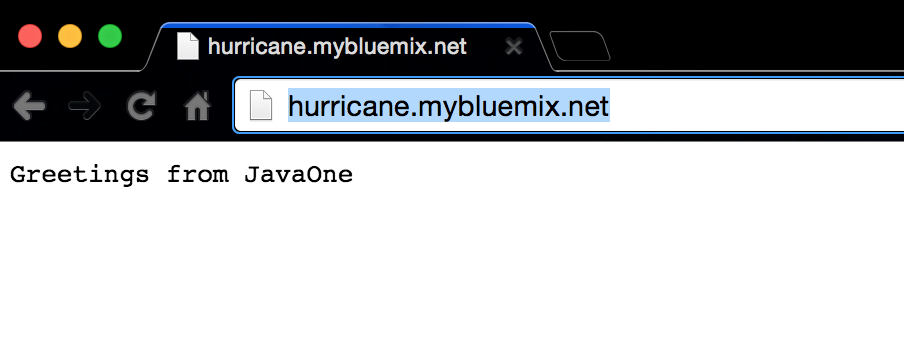
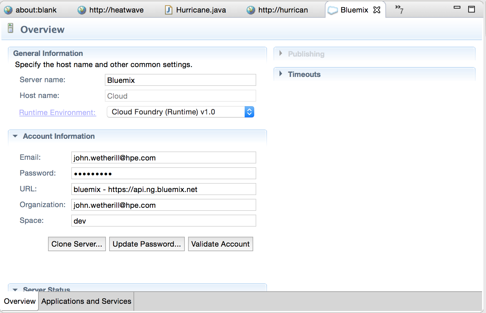

#Cloud Foundry on OpenStack Hands-On Labs

##Exercise 10: The Eclipse Cloud Foundry Plugin

Modern Java IDEs can easily support Cloud Foundry with the installation of various Cloud Foundry plugins. These plugins communicate directly with the Cloud Foundry API, in much the same way that the command line, web console do. With an IDE plugin you can manage the entire deployment process from the comfort of your IDE.

Here we'll show the steps to add Cloud Foundry support to Eclipse, create a simple servlet, and deploy it to the PaaS. This lab assumes you have previously installed Eclipse. If not, follow the steps [here](https://eclipse.org/downloads/). For this lab it's recommended you install the J2EE version of eclipse so you can rapidly create a servlet.
  

### Steps

#### First we configure Eclipse to define the Cloud Foundry Instance

1. Launch your Eclipse IDE

2. Install the Eclipse Cloud Foundry plugin This is trivial to do. Simply visit the [Cloud Foundry Integration for Eclipse](https://marketplace.eclipse.org/content/cloud-foundry-integration-eclipse) page on the Eclipse Marketplace, and drag the "Install" button onto your Eclipse enviroment.

3. Define a new Cloud Foundry server. Choose "File->New->Other" and choose "Server" from the window that appears. Choose "Pivotal->Cloud Foundry" as the server type. 

4. Enter your Cloud Foundry username and email address, and click "Manage Cloud...". 

5. Click the Add button and enter the URL for your Cloud Foundry endpoint.

#### Now create a servlet

3. Create a new Dynamic Web Project. Choose "File->New->Dynamic Web Project", type a project name of your choice, and click Finish

4. Create a Servlet in this project. Choose "File->New->Servlet" and complete the wizard.

5. Optionally edit the generated servlet code to customize the text that's printed. Here we replace the defult text with "Greetings from JavaOne".

#### Finally, run the servlet in the PaaS

1. Right-click the project, choose "Run As->Run on Server". Select your Cloud Foundry instance under Server->Cloud.

2. In the wizard that appears, choose a name for the application (as will appear on Cloud Foundry). This should be all lowercase.

3. Specify the launch deployment details. You can take the defaults here.  Check the Start Application on Deployment" checkbox.

4. Click Finish. After a minute or so you can visit your servlet in a browser. You can also visit it directly in Eclipse.

#### Explore the Cloud Foundry Plugin

The Cloud Foundry Eclipse Plugin allows you to manage several aspects of your PaaS-deployed applications. Explore these by clicking "Window->Explore Views->Servers", select your Cloud Foundry instance, and click the various tabs.

