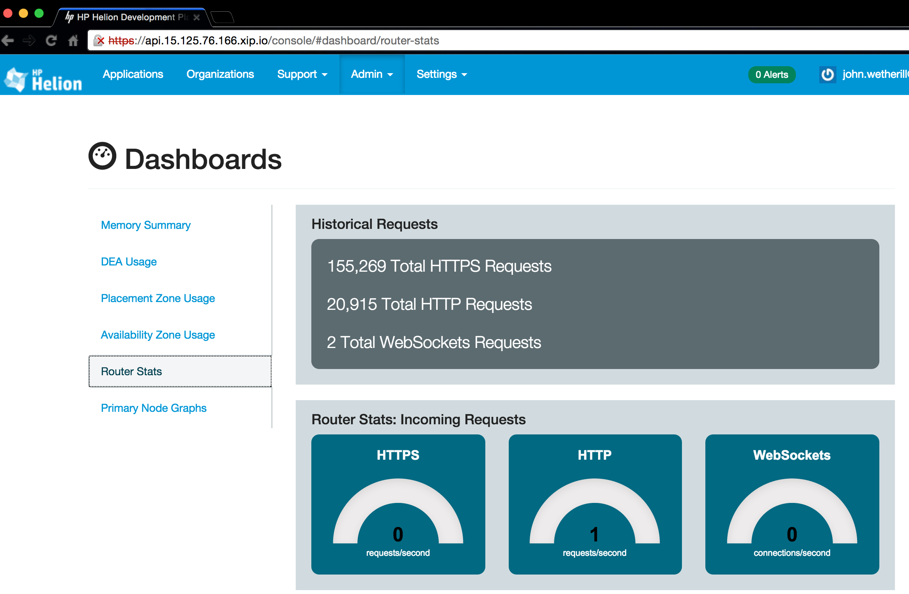
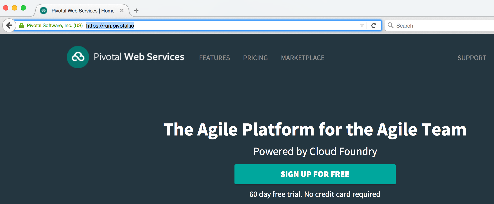
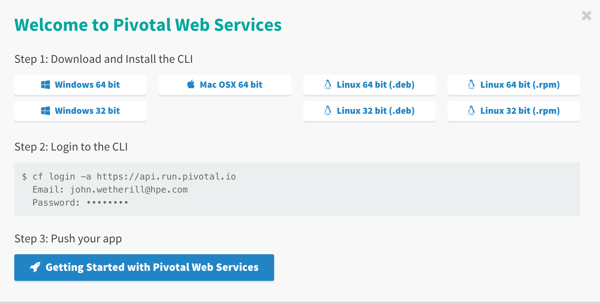

#Cloud Foundry Hands-On Labs

##Exercise 11: Cloud Foundry Interoperability

By definition, PaaS is an abstraction above the infrastructure layer. Which means, if you write an application to run on a PaaS, it will run on any infrastructure that the PaaS runs on, with no modification to the application itself.

Several Cloud Foundry distributions are available, both hosted instances as provided IBM, and Pivotal, as well as packaged private distributions that you can install in your own data center, or on your laptop. These include the open source distribution from the Cloud Foundry Foundation, as well as the Helion Developer Platform from Hewlett Packard Enterprise.

What this all boils down to is, with Cloud Foundry, you're not hampered by vendor lockin, and you can move you apps whereever you want.

In this workshop we illustrate this interoperability by provisioning the apps from the previous exercises to various Cloud Foundry instances including PivotalCF and HP's Helion Cloud Foundry.

## Helion Development Platform from Hewlett Packard
 
Hewlett Packard distributes a powerful Cloud Foundry distribution as part of its Helion Developer Platform (HDP). This platform encompasses rich functionality including ... and of course,  Cloud Foundry. A major advantage of HDP and is that it can be hosted anywhere, on any infrastructure including OpenStack, VMware, AWS, Azure, Cloud Platform, and others.

We created an instance of HDP on OpenStack, in HP's public cloud. You will be provided a username and password for this instance which you can use to push your apps to, in the exact same manner as you pushed them to Bluemix in earlier exercises.


Here are the steps:

1. First, to use the Helion Developer Platform Cloud Foundry instance you'll need to use the "helion" command line client. This is the counterpart to the "cf" client you used earlier, but has enhancements to support HDP.

2. Now you login and target the HDP PaaS:

``` 
  $ cf target api.15.125.76.166.xip.io
  $ cf login
  # enter the username/password as provided to you
  $ cd javaone-cloudfoundry-hol/samples/PCF-demo
  $ cf push
```

While you're working with the HDP, we recommend you have a look at the powerful web console that's provided. From here you can manage almost all aspects of application development including provisioning, versioning, scaling, and securing your apps.

To access the console from your browser simple visit 
api.15.125.76.166.xip.io and login using the credentials we provided.




## Pivotal Web Services
 
First step is to signup for a free trial account on Pivotal Web Services.  Visit [https://run.pivotal.io](https://run.pivotal.io) and click the SIGN UP FOR FREE button.



Follow the steps here. You'll need to provide them with a phone number so they can send you, via SMS, a validation code.

After you have registered you will be able to use the Pivotal-hosted Cloud Foundry instance exactly as you did with Bluemix in the previous exercises.

And no need to download the "cf" client as you already have it.



Here are the steps to target the Pivotal Cloud Foundry and push the PCF-demo app from the previous exercise:

 
 

```
  $ cf login -a https://api.run.pivotal.io
  #  enter username/password you specified when signing up for Pivotal
  $ cd javaone-cloudfoundry-hol/samples/PCF-demo
  $ cf push
```
 
 That's all there is to it.

 
  
  

