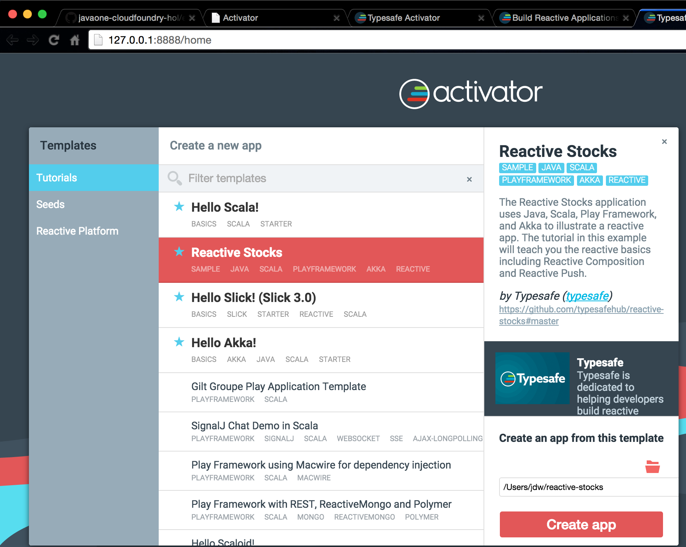
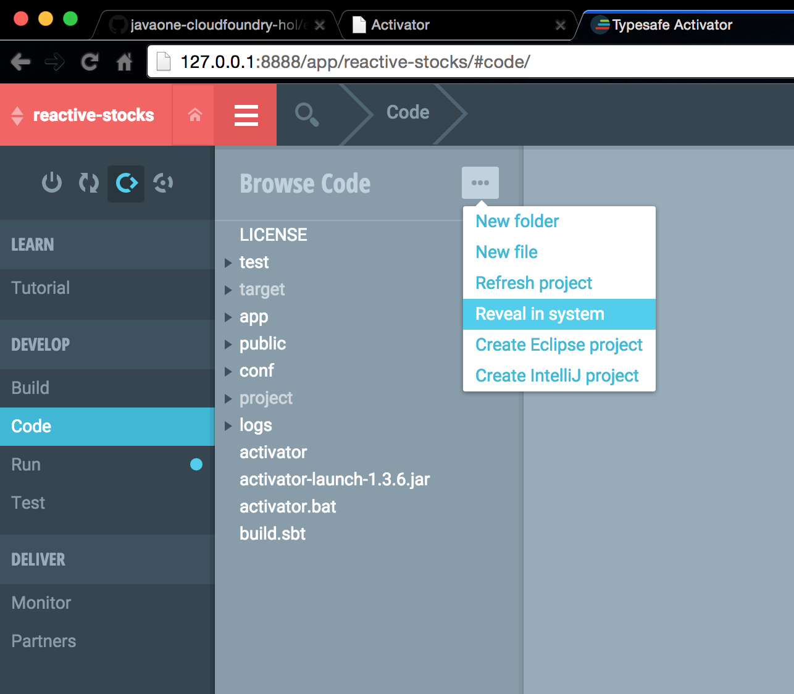

#Cloud Foundry Hands-On Labs

##Exercise 12: Polyglot Adventures

One of the many benefits of Cloud Foundry is its ability to provision applications built with multiple language and frameworks. Cloud Foundry is equally at home with apps built in Java, Python, PHP, Ruby, Node.js, and custom buildpacks can be used to deploy applications built with almost any languages known to mankind including [FORTAN](https://github.com/martinrehfeld/heroku-buildpack-f77), [COBOL](https://github.com/ayumin/heroku-buildpack-cobol), and [Haskell](http://catdevrandom.me/blog/2013/05/16/buildpacks-in-cloud-foundry-v2/), and [Erlang](https://github.com/spiegela/cf-buildpack-erlang).

If you're at JavaOne, you can start with JVM-based languages, but this still exploit a nice palette of powerful languages from including Java, Scala, Clojure, Jython, JRuby, Grails.

Here we'll provision a handful of apps using a selection of these languages. Feel free to use the samples provided, or you're more than welcome to bring your own. The steps are pretty much the same.

### Clojure

Clojure is basically a modern JVM-based LISP, extremely powerful and expressive. Here we'll deploy the simple Clojure web application [ClojureSphere](https://github.com/Stackato-Apps/clojuresphere).

Note that Clojure isn't recognized by the default Java buildpack, so you need to specify an external buildpack to get it to run. Conveniently the heroku folks provide [Clojure buildpack](git://github.com/heroku/heroku-buildpack-clojure.git) that works perfectly.


Steps:

a. You'll need the "lein" clojure build tool to package the app. This is trivial to install, following [these steps](http://leiningen.org/#install)

b. Clone the ClojureSphere application

```
   git clone https://github.com/Stackato-Apps/clojuresphere
```


c. Build the application using lein

  ``` 
     cd clojuresphere
     cf login -a https://api.ng.bluemix.net
     lein deps
  ```
  
d. Deploy this application to Cloud Foundry

This requires explicit specification of the external Heroku buildpack for Clojure.

```
   cf push clojuresphere  -b git://github.com/heroku/heroku-buildpack-clojure.git
```


e. Now the app is deployed. The output of the push command will show the specific URL to access it, or you can determine this with the "cf apps" command.

```
cf apps

name                      requested state   instances   memory   disk   urls
clojuresphere             started           1/1         1G       1G     clojuresphere.mybluemix.net
```

f. Visit the route of the application deployed via the browser.
   

### Scala

Scala, or SCAlable LAnguage, is a powerful statically-typed extensible JVM based language that's kind of a hybrid Object Oriented and Functional language. It's getting lots of traction: Twitter famously adopted Scala as a core language, and other important companies have followed suit.

To build a Scala application it's recommended to use the "Activator" build tool from Typesafe. Here's we'll install Activator, build a simple app, and deploy it to the PaaS.

Steps:

a. Visit the [TypeSafe Activator](https://www.typesafe.com/activator/download) site and click the Download button to download the bits for Activator.

b. Unzip the downloaded file, then double-click the "activator" executable contained in this archive. This will launch the Activator IDE in your browser.

c. Under Tutorials, select an application to build. Here we'll choose the "Reactive Stocks" app.  Click the "Create App" button.



d. After the application builds, you'll need to locate the app source folder, which defaults to ~/reactive-stocks.  To verify this location, click "Code" on the left, then click the elipses beside Browse Code and choose "Reveal in system".




e. In a shell, navigate to this directory, and push the application to Cloud Foundry as before. Note that you need to specify the Scala buildpack from Heroku.

```
   cd reactive-stocks
   cf login -a https://api.ng.bluemix.net
   cf push
```

f. Now the app is deployed. The output of the push command will show the specific URL to access it, or you can determine this with the "cf apps" command. 

```
cf apps

name                      requested state   instances   memory   disk   urls

reactive-stocks           started           1/1         1G       1G     reactive-stocks.mybluemix.net
```

g. Visit the route of the application deployed via the browser.


## Other languages

As mentioned above, Cloud Foundry supports a host of languages. Here are instructions to quickly deploy a handful of apps built using PHP, Ruby, Node.js, Python, and Java.


### Node.js

```
  git clone https://github.com/Stackato-Apps/node-chat.git
  cd node-chat
  cf push
```

###  PHP  (Wordpress)

```
  git clone https://github.com/Stackato-Apps/wordpress.git
  cd wordpress
  cf push
```

### Python

```
  git clone https://github.com/Stackato-Apps/bottle-currency.git
  cd bottle-currency
  cf push
```

### Ruby (Sinatra)

```
  git clone https://github.com/Stackato-Apps/sinatra-rabbitmq.git
  cd sinatra-rabbitmq
  cf push
```

### Java

```
  git clone https://github.com/Stackato-Apps/hello-java.git
  cd hello-java
  cf push
```
