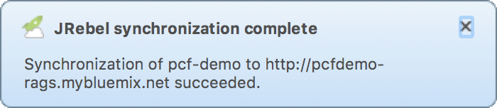

#Cloud Foundry Hands-On Labs

##Exercise 12: Rapid Deployment with JRebel

Ensure that you are in sub-directory `exc`.

As you've probably been wondering, although Cloud Foundry significantly eases deployment in general, it's still time consuming and tedious. Is it possible to speed up the deployment process?

[JRebel] (https://zeroturnaround.com/software/jrebel/) uses the [JVM HotSwap] (http://zeroturnaround.com/blog/reloading_java_classes_401_hotswap_jrebel/) to load classes without dynamic class loaders. In other words, there is no need to push the app to test every change, small or sizeable. It's great for rapid deployment.

We will generally follow the steps at [http://manuals.zeroturnaround.com/jrebel/remoting/bluemix.html](http://manuals.zeroturnaround.com/jrebel/remoting/bluemix.html).

Installing JRebel for Eclipse.

* Install the the [JRebel plugin] (https://zeroturnaround.com/software/jrebel/quickstart/eclipse/) for Eclipse.
* Configure the project for [JRebel support] (http://manuals.zeroturnaround.com/jrebel/remoteserver/eclipse.html#eclipseremoteserver).  **Provide the URL of the running app on Bluemix (for example http://\<app-route\>.ng.mybluemix.net. No Authentication is required. Follow Steps 1 and 2. We will do Step 3 in a bit**.

Setup the app. as an Eclipse project.

* Open Eclipse and under File/Import.../Maven/Existing Maven Projects and click Next>
* In the Maven Projects dialog browse to the directory and the subdirectory `samples/exc/PCF-demo` 

This should setup the project as a Maven project in Eclipse with remote server support. If it's not enabled do it explicitly as below.

Enable remote server support.

* Right Click on the project and JRebel/Enable JRebel Nature.
* Right Click on the project and JRebel/Enable remote server support.

Ensure the JRebel files are part of the project as below.

```
find . -name \*rebel\*.xml
```

The output should be something like below.

```
./src/main/resources/rebel-remote.xml
./src/main/resources/rebel.xml
./target/classes/rebel-remote.xml
./target/classes/rebel.xml
./target/pcfdemo/WEB-INF/classes/rebel-remote.xml
./target/pcfdemo/WEB-INF/classes/rebel.xml
```

Push the application with remote server support enabled.

* Right Click on the project and Run as/Maven Build with package as a target (You can do this from the command line as well). In essence you're building a JAR file that you will push next.
* Right Click on the project and Run as/Run on Server which should deploy the application remotely.


Let's test out rapid deployment.

* Let's make a small change in the file pcfdemo.jsp. Change tip to hint.
* Click on the project in Eclipse/JRebel and Synchronize.

If everything has been setup, correctly you should be able to get a message that the project was synchronized.



Refreshing the browser, you should be able to see that the "tip: click on a state for details" has been changed to "hint: click on a state for details".

You can try other changes, both trivial and non-trivial.