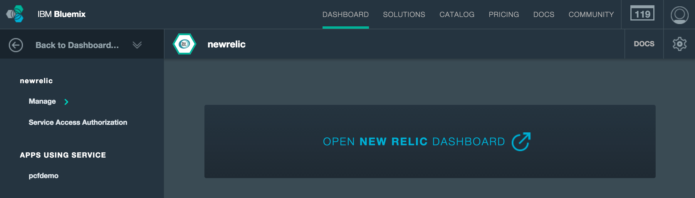
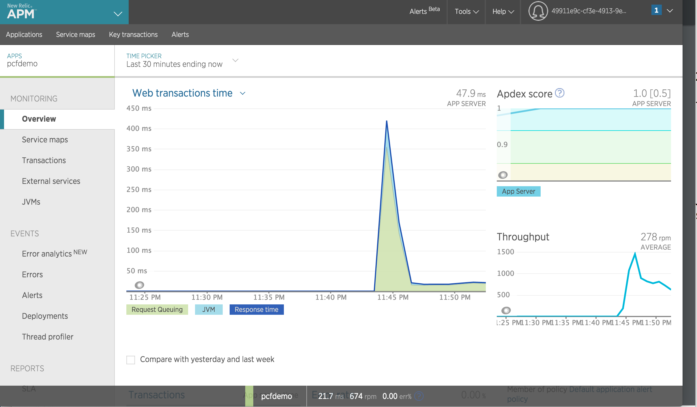

#Cloud Foundry Hands-On Labs

##Exercise 13: Monitoring with New Relic

Monitoring via [New Relic] (http://newrelic.com/) is very straightforward. You simply create a New Relic service, bind to the service and access the New Relic dashboard via the Bluemix console.

Create a New Relic service with the following command.

```
cf create-service newrelic standard newrelic
```

Bind to the created service.

```
cf bind-service pcfdemo newrelic
```
Restage the app.

```
cf restage pcfdemo
```
Open the console at [http://console.ng.bluemix.net/] (http://console.ng.bluemix.net/) click on Dashboard tab, Services and `newrelic` and open the New Relic Dashboard as below.



Clicking on the link in the console and the application should bring you to the New Relic Dashboard as shown below.



You can check the stats around. That's all there is to it!